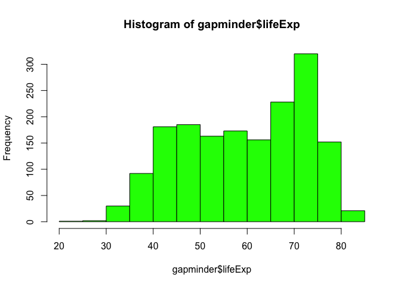
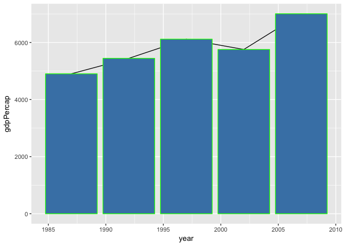
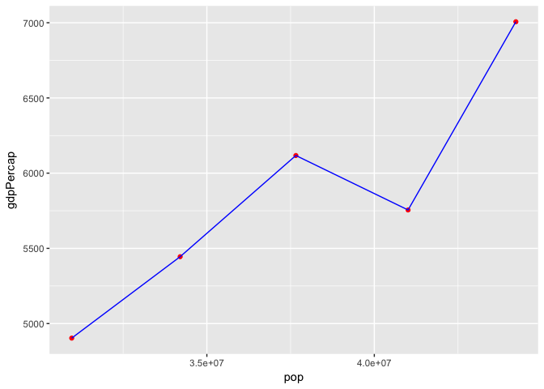
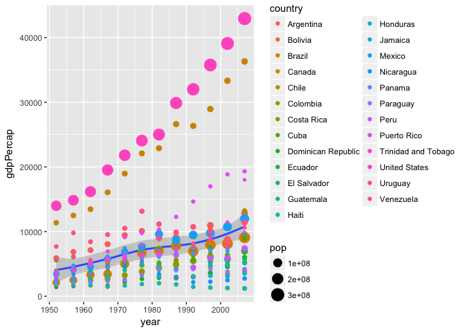

HW2
================
juan
2017-09-26

Welcome to Juan's Homework 2
============================

In this first part of the assignment, we will see the **data type** of the gapminder package and variables as well as the **structure**, **names** and **summaries**.

``` r
library(gapminder)
suppressMessages(library(tidyverse))

str(gapminder)
```

    ## Classes 'tbl_df', 'tbl' and 'data.frame':    1704 obs. of  6 variables:
    ##  $ country  : Factor w/ 142 levels "Afghanistan",..: 1 1 1 1 1 1 1 1 1 1 ...
    ##  $ continent: Factor w/ 5 levels "Africa","Americas",..: 3 3 3 3 3 3 3 3 3 3 ...
    ##  $ year     : int  1952 1957 1962 1967 1972 1977 1982 1987 1992 1997 ...
    ##  $ lifeExp  : num  28.8 30.3 32 34 36.1 ...
    ##  $ pop      : int  8425333 9240934 10267083 11537966 13079460 14880372 12881816 13867957 16317921 22227415 ...
    ##  $ gdpPercap: num  779 821 853 836 740 ...

``` r
names(gapminder)
```

    ## [1] "country"   "continent" "year"      "lifeExp"   "pop"       "gdpPercap"

``` r
length(gapminder)
```

    ## [1] 6

``` r
summary(gapminder)
```

    ##         country        continent        year         lifeExp     
    ##  Afghanistan:  12   Africa  :624   Min.   :1952   Min.   :23.60  
    ##  Albania    :  12   Americas:300   1st Qu.:1966   1st Qu.:48.20  
    ##  Algeria    :  12   Asia    :396   Median :1980   Median :60.71  
    ##  Angola     :  12   Europe  :360   Mean   :1980   Mean   :59.47  
    ##  Argentina  :  12   Oceania : 24   3rd Qu.:1993   3rd Qu.:70.85  
    ##  Australia  :  12                  Max.   :2007   Max.   :82.60  
    ##  (Other)    :1632                                                
    ##       pop              gdpPercap       
    ##  Min.   :6.001e+04   Min.   :   241.2  
    ##  1st Qu.:2.794e+06   1st Qu.:  1202.1  
    ##  Median :7.024e+06   Median :  3531.8  
    ##  Mean   :2.960e+07   Mean   :  7215.3  
    ##  3rd Qu.:1.959e+07   3rd Qu.:  9325.5  
    ##  Max.   :1.319e+09   Max.   :113523.1  
    ## 

``` r
summary(gapminder$gdpPercap)
```

    ##     Min.  1st Qu.   Median     Mean  3rd Qu.     Max. 
    ##    241.2   1202.1   3531.8   7215.3   9325.5 113523.1

``` r
typeof(gapminder)
```

    ## [1] "list"

``` r
typeof(gapminder$year)
```

    ## [1] "integer"

``` r
typeof(gapminder$lifeExp)
```

    ## [1] "double"

``` r
a<- filter(gapminder, continent == "Americas")
select(filter(a, country== "Colombia"), country, gdpPercap, lifeExp, year) 
```

    ## # A tibble: 12 x 4
    ##     country gdpPercap lifeExp  year
    ##      <fctr>     <dbl>   <dbl> <int>
    ##  1 Colombia  2144.115  50.643  1952
    ##  2 Colombia  2323.806  55.118  1957
    ##  3 Colombia  2492.351  57.863  1962
    ##  4 Colombia  2678.730  59.963  1967
    ##  5 Colombia  3264.660  61.623  1972
    ##  6 Colombia  3815.808  63.837  1977
    ##  7 Colombia  4397.576  66.653  1982
    ##  8 Colombia  4903.219  67.768  1987
    ##  9 Colombia  5444.649  68.421  1992
    ## 10 Colombia  6117.362  70.313  1997
    ## 11 Colombia  5755.260  71.682  2002
    ## 12 Colombia  7006.580  72.889  2007

The life Expectancy looks to be near 75
---------------------------------------

``` r
hist(gapminder$lifeExp, col="green")
```



#### In this second part of the assignment, I'm going to show the increment of population, life expectancy and gdpper capita in Colombia and other contries in the Americas since the year I was born (1987). This is to prove my theory that I brought good things to the world.

Here we have Colombia's Life Expectancy, gdpPercapita and Population digits since 1987 to 2004. As we can see in the graph below there was a hiccoup in the economy in 2002 follow by an significant recovery.

``` r
my_colombia<- a %>% 
  filter(country== "Colombia", year >= 1987) %>%
  select(country, year, lifeExp, gdpPercap, pop)
my_colombia
```

    ## # A tibble: 5 x 5
    ##    country  year lifeExp gdpPercap      pop
    ##     <fctr> <int>   <dbl>     <dbl>    <int>
    ## 1 Colombia  1987  67.768  4903.219 30964245
    ## 2 Colombia  1992  68.421  5444.649 34202721
    ## 3 Colombia  1997  70.313  6117.362 37657830
    ## 4 Colombia  2002  71.682  5755.260 41008227
    ## 5 Colombia  2007  72.889  7006.580 44227550



Now let's look at the growing life expectancy variable. Here are the increment numbers and **the function that I wrote** to see the results:
--------------------------------------------------------------------------------------------------------------------------------------------

``` r
inc<- function(x,y) {z<- x - y}
mutate(my_colombia, inc_lifeExp= inc(lifeExp, lifeExp[+1]), inc_gdpPercap= inc(gdpPercap, gdpPercap[+1]))
```

    ## # A tibble: 5 x 7
    ##    country  year lifeExp gdpPercap      pop inc_lifeExp inc_gdpPercap
    ##     <fctr> <int>   <dbl>     <dbl>    <int>       <dbl>         <dbl>
    ## 1 Colombia  1987  67.768  4903.219 30964245       0.000        0.0000
    ## 2 Colombia  1992  68.421  5444.649 34202721       0.653      541.4295
    ## 3 Colombia  1997  70.313  6117.362 37657830       2.545     1214.1426
    ## 4 Colombia  2002  71.682  5755.260 41008227       3.914      852.0409
    ## 5 Colombia  2007  72.889  7006.580 44227550       5.121     2103.3613

Now, let's see the population vs gdpPercap
------------------------------------------

``` r
my_colombia %>%
  arrange(year) %>% 
  ggplot(aes(pop, gdpPercap)) +
  geom_point(color= "red") +
  geom_path(color= "blue")
```



But enough about Colombia, let's see how other countries in the Americas have done since I came to earth:
---------------------------------------------------------------------------------------------------------

``` r
a %>%
  group_by(country) %>% 
  ggplot(aes(year, gdpPercap)) + geom_smooth()+
  geom_point(aes(color= country, size= pop ))
```

    ## `geom_smooth()` using method = 'loess'



#### So, we can conclude that most countries have seen some improvemnts in gdpPercapita and an increase in population. (Also, that I haven't learnt how to read the graphs and I specualte a lot, I'm working on that)
