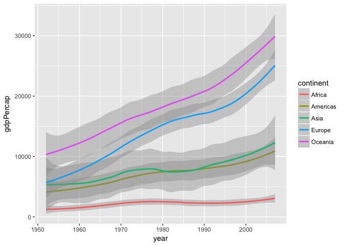
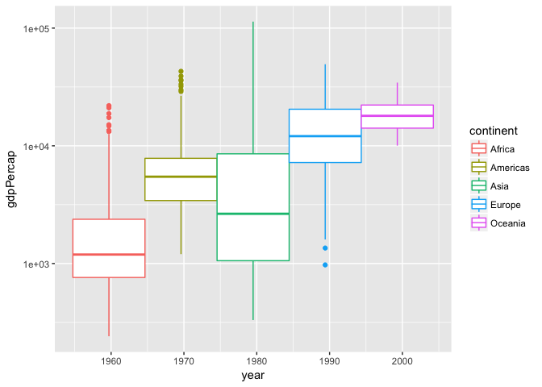
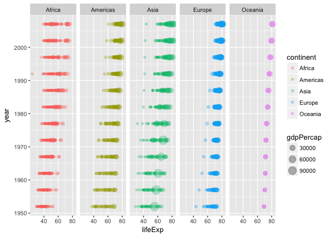
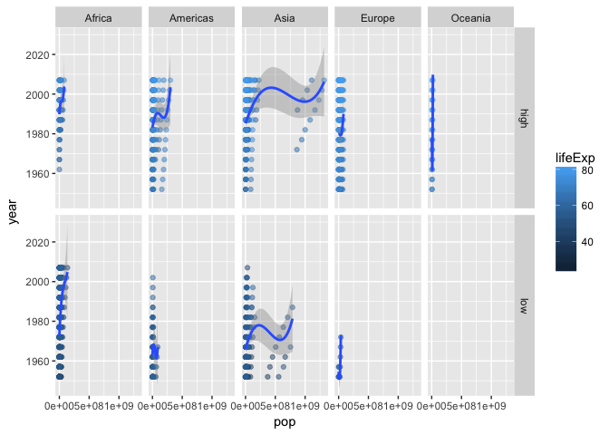
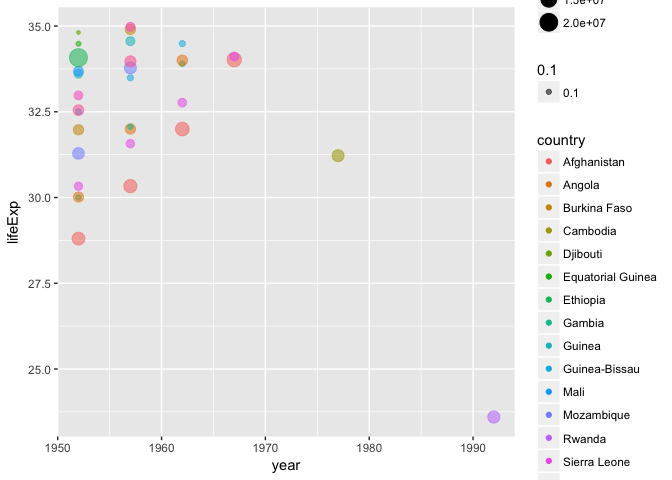
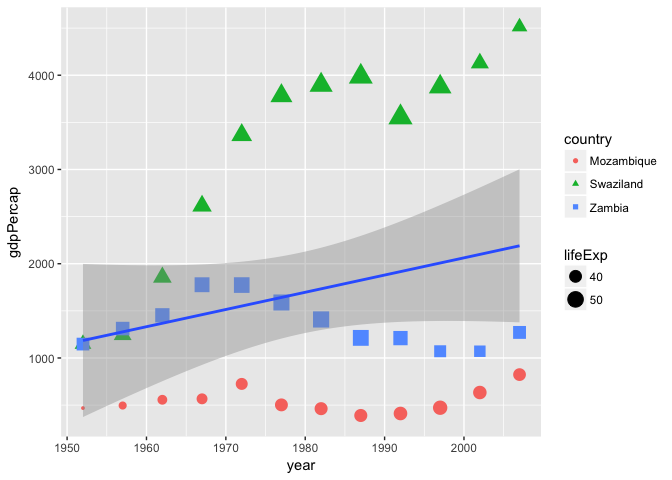

HW\#3
================
juan
2017-09-27

``` r
library(gapminder)
library(tidyverse)
```

    ## Loading tidyverse: ggplot2
    ## Loading tidyverse: tibble
    ## Loading tidyverse: tidyr
    ## Loading tidyverse: readr
    ## Loading tidyverse: purrr
    ## Loading tidyverse: dplyr

    ## Conflicts with tidy packages ----------------------------------------------

    ## filter(): dplyr, stats
    ## lag():    dplyr, stats

###### Homework 3

-   Get the maximum and minimum of GDP per capita for all continents.
-   MEAN, MAX and MIN gdps per capita.

``` r
gdps<- gapminder %>%
  group_by(continent) %>% 
  select(gdpPercap) %>% 
summarise(mean_gdp= mean(gdpPercap),max_gdp= max(gdpPercap), min_gdp= min(gdpPercap) ) 
```

    ## Adding missing grouping variables: `continent`

``` r
gdps %>% 
  knitr::kable(format = "markdown", padding=2, caption= "MEAN, MAX and MIN gdps per capita")
```

| continent |  mean\_gdp|   max\_gdp|    min\_gdp|
|:----------|----------:|----------:|-----------:|
| Africa    |   2193.755|   21951.21|    241.1659|
| Americas  |   7136.110|   42951.65|   1201.6372|
| Asia      |   7902.150|  113523.13|    331.0000|
| Europe    |  14469.476|   49357.19|    973.5332|
| Oceania   |  18621.609|   34435.37|  10039.5956|

``` r
gapminder %>%
  group_by(continent) %>% 
  ggplot(aes(year, gdpPercap, color= continent))+
  geom_smooth(method="loess", span=0.5)
```



-   Compute a trimmed mean of life expectancy for different years. Or a weighted mean, weighting by population. Just try something other than the plain vanilla mean.

-   Here I calculated both the **trimmed** and **weighted** mean of the life expectancy per year.

``` r
means<- gapminder %>%
  group_by(year) %>%
  summarize(tm_lifeExp = mean(lifeExp, trim= 0.2), wmean= weighted.mean(lifeExp, pop)) 
means %>% 
  knitr::kable(format = "markdown", padding=2, caption= "Trimmed and weighted means")
```

|  year|  tm\_lifeExp|     wmean|
|-----:|------------:|---------:|
|  1952|     47.74866|  48.94424|
|  1957|     50.64422|  52.12189|
|  1962|     53.12857|  52.32438|
|  1967|     55.63999|  56.98431|
|  1972|     58.12370|  59.51478|
|  1977|     60.38896|  61.23726|
|  1982|     62.47444|  62.88176|
|  1987|     64.48383|  64.41635|
|  1992|     65.89072|  65.64590|
|  1997|     66.84437|  66.84934|
|  2002|     67.77385|  67.83904|
|  2007|     69.17224|  68.91909|

``` r
means %>% ggplot(aes(wmean, tm_lifeExp, color= year  ) )+ geom_point()+ geom_path()
```



-   How is life expectancy changing over time on different continents?

``` r
ggplot(gapminder, aes(lifeExp, year , size= gdpPercap, color= continent)) +
    facet_grid(~ continent) +
    geom_point(alpha= 0.3)
```



-   Report the absolute and/or relative abundance of countries with low life expectancy over time by continent: Compute some measure of worldwide life expectancy – you decide

-   The benchmark for the analysis is the mean life expectancy (59.47444). I will devide the results in **high** life expectancy if it is higher than the mean or **low** if otherwise.

``` r
mean(gapminder$lifeExp)
```

    ## [1] 59.47444

``` r
gapminder %>%
  arrange(year, lifeExp) %>% 
  mutate(l_ex=ifelse(lifeExp< mean(lifeExp), "low", "high")) 
```

    ## # A tibble: 1,704 x 7
    ##          country continent  year lifeExp     pop gdpPercap  l_ex
    ##           <fctr>    <fctr> <int>   <dbl>   <int>     <dbl> <chr>
    ##  1   Afghanistan      Asia  1952  28.801 8425333  779.4453   low
    ##  2        Gambia    Africa  1952  30.000  284320  485.2307   low
    ##  3        Angola    Africa  1952  30.015 4232095 3520.6103   low
    ##  4  Sierra Leone    Africa  1952  30.331 2143249  879.7877   low
    ##  5    Mozambique    Africa  1952  31.286 6446316  468.5260   low
    ##  6  Burkina Faso    Africa  1952  31.975 4469979  543.2552   low
    ##  7 Guinea-Bissau    Africa  1952  32.500  580653  299.8503   low
    ##  8   Yemen, Rep.      Asia  1952  32.548 4963829  781.7176   low
    ##  9       Somalia    Africa  1952  32.978 2526994 1135.7498   low
    ## 10        Guinea    Africa  1952  33.609 2664249  510.1965   low
    ## # ... with 1,694 more rows

``` r
gapminder %>%
  arrange(year, lifeExp) %>% 
  mutate(l_ex=ifelse(lifeExp<= mean(lifeExp), "low", "high")) %>% 
  ggplot(aes( pop, year, color=lifeExp)) +
    facet_grid(l_ex ~ continent) +
    geom_point(alpha= 0.5)+ 
  geom_smooth(method="loess", span=1)
```



##### Find countries with interesting stories. Open-ended and, therefore, hard. Promising but unsuccessful attempts are encouraged. This will generate interesting questions to follow up on in class.

-   Countries with painfully low life expectancy due to various factors such as **war**, **diseases** or **scarcity** of resources. The crisis in Rwanda brought the life expectancy to aprox. 23.59 in the 90's.

``` r
gapminder %>%
  filter(lifeExp<= 35) %>% 
  arrange(year, lifeExp) %>% 
  ggplot(aes(year, lifeExp, size= pop)) +
    geom_point(aes(color= country, alpha= 0.1))
```



-   Make up your own! Between the dplyr coverage in class and the list above, I think you get the idea.
-   The 10 countries with the lowest life expectancy growth.

``` r
gapminder %>%
  group_by(country) %>% 
  select(country, year, lifeExp) %>% 
  mutate(lifeExp_growth = lifeExp - first(lifeExp)) %>% 
  arrange(lifeExp_growth) %>% head(10) %>% 
  knitr::kable(format = "markdown", padding=2, caption= "Life expectancy growth")
```

| country   |  year|  lifeExp|  lifeExp\_growth|
|:----------|-----:|--------:|----------------:|
| Rwanda    |  1992|   23.599|          -16.401|
| Zimbabwe  |  2002|   39.989|           -8.462|
| Cambodia  |  1977|   31.220|           -8.197|
| Zimbabwe  |  2007|   43.487|           -4.964|
| Rwanda    |  1997|   36.087|           -3.913|
| Zambia    |  2002|   39.193|           -2.845|
| Zambia    |  1997|   40.238|           -1.800|
| Swaziland |  2007|   39.613|           -1.794|
| Zimbabwe  |  1997|   46.809|           -1.642|
| Botswana  |  2002|   46.634|           -0.988|

The three countries with lowest life expentancy in 2007.

``` r
gapminder %>%
arrange(lifeExp) %>% 
filter(year== 2007) %>% 
  head(3) %>% knitr::kable()
```

| country    | continent |  year|  lifeExp|       pop|  gdpPercap|
|:-----------|:----------|-----:|--------:|---------:|----------:|
| Swaziland  | Africa    |  2007|   39.613|   1133066|  4513.4806|
| Mozambique | Africa    |  2007|   42.082|  19951656|   823.6856|
| Zambia     | Africa    |  2007|   42.384|  11746035|  1271.2116|

Swaziland had the lowest life expectancy in 2007. However, compared to Mozambique and Zambia (the next two countries in the list), its gdp Per capita is high.

``` r
gapminder %>%
  filter(country== "Swaziland" | country== "Mozambique" | country== "Zambia" ) %>% 
  select(country, year, lifeExp, gdpPercap ) %>%
ggplot( aes(year , gdpPercap)) +
    geom_point(aes(size=lifeExp , shape= country, color= country ))+
  stat_smooth(method="lm")
```



Reflection
----------

1\_ I need to refresh my knowledge in statistics in order to understand what linear regression, or any regression, means and what it indicates. So far, I have made advance in the aesthetics part (colors, shapes, different types of graphs). I liked the peer reviews because i could see the progress of other people and learn from the way they read data and interpret the results; i still need to work more on that.

2\_ It is really fun to explore this dataset, it tells lots of stories. I found a little trouble plotting all the countries at the same time because it is a lots of datapoints and the graphs and labels overlap too much. I find that low alphatransparency helps us seeing the overlaps which is important.

3\_ I tried to write most of the code using piping but sometimes I used the simple nested functions just to try everything.

4\_ I learned the hard way that &lt;- and = can not be used interchangably to define variables, as I learned in my first R course. They throw different results when used in nested functions.
