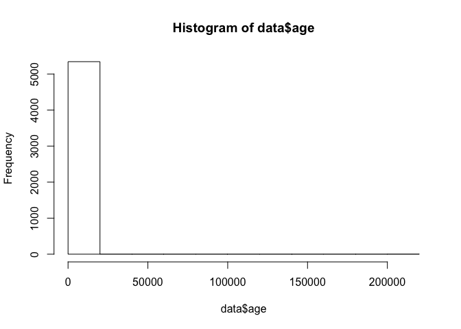
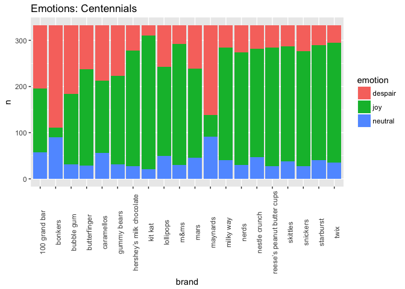
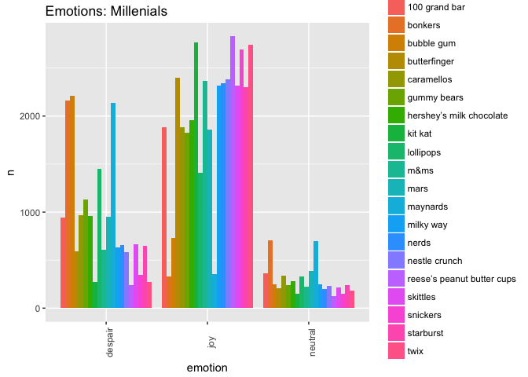
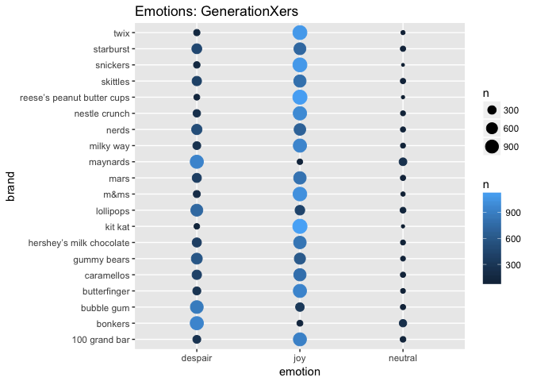
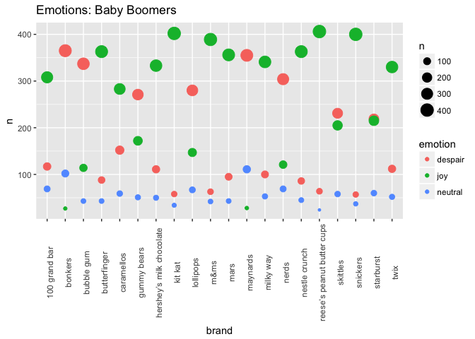
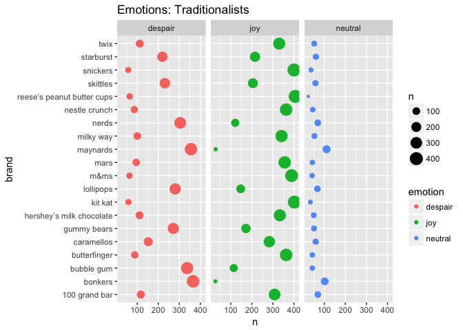

hw6-2
================
juan
2017-11-06

``` r
library(gapminder)
library(purrr)
library(devtools)
library(stringr)
library(listviewer)
library(tibble)
library(forcats)
library(ggplot2)
library(png)
library(grid)
library(RColorBrewer)
library(gapminder)
library(readxl)
suppressPackageStartupMessages(library(dplyr))
suppressMessages(library(gridExtra) )
suppressMessages(library(mgcv))
suppressMessages(library(jsonlite))
suppressPackageStartupMessages(library(tidyverse))
```

### Welcome to part two of HMW6

stumbling from step 1 :( The command: install.github(jennybc/candy) did not work for some reason. So I went ahead and forked the candy repo and tried to install it from my repo. Failed again, so I had to download the .xlsx to my mac and import the dataset manually using this code:

``` r
library(readxl)
suppressMessages(candy <- read_excel("~/Downloads/CANDY-HIERARCHY-2015-SURVEY-Responses.xlsx"))
```

    ## Warning in strptime(x, format, tz = tz): unknown timezone 'zone/tz/2017c.
    ## 1.0/zoneinfo/America/Vancouver'

#### Intial thoughts and observations:

In all my years as data scientist **(0 years)**, I have learnt that nothing with data is easy. Add to that the fact that my r skills aren't sharp enought yet (getting there tho) and that I'm an expert in getting errors in Rstutio. So, yes, it was all confusing from the begining.
Anyway, this analysis will be based on the sentiments expressed by participants of the halloween surver 2015 and will serve the purpose of revealing what is people's favourite candy and most hated candy. In order to do this, many issue need to be solved first, for example, I should clean a bit of things: \* Irrelevant Data: leave out all non-candy products in the dataset \* Format of the names in the columns:the name of the columns are messy, lists\[\] and brackers() \* Coercing datatypes: different datatypes in some attributes (age appears as characters instead of numeric, sign of something fishy) \* Dealing with missing values:I have not learnt how to deal with NA, so i'll replace them for "None" or ignore them. \* String Formats: lowercase all values I'll drop some columns that I find irrelevant. "spotted dicks", really? what is that? swedish fish? is there a fish flavour candy?? yuck!! All the columns that have opinions will be ignored because time is scarce and that takes a lot of coding, maybe in future assignments it could be taken into consideration, cleaned and analysed. I'll keep only candy and columns with joy and despair.

``` r
#summary(candy)
#str(candy)
#glimpse(candy)
#class(candy)
#head(candy, n=20)
```

-   I did do the exploratory using the above functions part but I will not execute the code because the results take many pages. Once I clean the data I'll print them. The number of candy is very broad, in my country there are 8 kinds of candy tops, I don't know many of the ones listed here.
-   Since there is no attribute that connect the data to "real candy" and "not candy", I'll select the true candy manually and I'll leave out the non-candy.

``` r
preselectedcandy<- c( "How old are you?","[Butterfinger]", "[100 Grand Bar]", "[Bonkers]","[Bubble Gum]", "[Caramellos]", "[Snickers]", "[Gummy Bears straight up]", "[Mars]", "[Maynards]", "[Skittles]", "[Kit Kat]","[Twix]", "[Starburst]", "[Nerds]", "[Nestle Crunch]", "[Milky Way]", "[Reese’s Peanut Butter Cups]", "[Lollipops]", "[Hershey’s Milk Chocolate]", "[Regular M&Ms]") 
data<-candy %>% select(preselectedcandy)
```

-   The names contain square brackets which is unnecessary and some of them have extra information such as "regular" or "straight up". I'll clean the names first using stringr::str\_replace\_all(), str\_trim() and some regex. (wooohoo already profiting from knowledge gained in part one of the hmwk)

``` r
formated_names<-str_replace_all(preselectedcandy,c("\\[" = " ", "\\]" = " ")) %>% str_trim()
names(data)<- formated_names
```

``` r
new_names<-names(data) %>% str_replace_all(c("How old are you\\?"="Age", "Gummy Bears straight up"= "Gummy Bears", "Regular M&Ms"= "M&Ms")) %>% tolower()
names(data)<- new_names
data %>% head()
```

    ## # A tibble: 6 x 21
    ##     age butterfinger `100 grand bar` bonkers `bubble gum` caramellos
    ##   <chr>        <chr>           <chr>   <chr>        <chr>      <chr>
    ## 1  35.0          JOY            <NA>    <NA>      DESPAIR       <NA>
    ## 2  41.0          JOY             JOY DESPAIR      DESPAIR    DESPAIR
    ## 3  33.0      DESPAIR         DESPAIR DESPAIR      DESPAIR        JOY
    ## 4  31.0          JOY             JOY DESPAIR      DESPAIR        JOY
    ## 5  30.0         <NA>             JOY    <NA>         <NA>        JOY
    ## 6  38.0          JOY             JOY     JOY      DESPAIR        JOY
    ## # ... with 15 more variables: snickers <chr>, `gummy bears` <chr>,
    ## #   mars <chr>, maynards <chr>, skittles <chr>, `kit kat` <chr>,
    ## #   twix <chr>, starburst <chr>, nerds <chr>, `nestle crunch` <chr>,
    ## #   `milky way` <chr>, `reese’s peanut butter cups` <chr>,
    ## #   lollipops <chr>, `hershey’s milk chocolate` <chr>, `m&ms` <chr>

-   Time to tackle the age format. It appears as chr instead of numeric. It is because down there some values are strings ("old enough", "really old", "none of your business"...). Since one column can only have one datatype, it came as character. I'll change it into numeric which will make coerce characers into NAs. I'll also try to find outliers.

``` r
data$age<-as.integer(data$age) 
```

    ## Warning: NAs introduced by coercion

    ## Warning: NAs introduced by coercion to integer range

``` r
hist(data$age)
```



-   It is normal at this stage to see such wacky graphs. Clearly there are some mistakes with the data. We'll examine the tables to see age clearly. All values are now in integer format, so strings were coerced into NA.

``` r
data %>% arrange(desc(age)) %>% head()
```

    ## # A tibble: 6 x 21
    ##      age butterfinger `100 grand bar` bonkers `bubble gum` caramellos
    ##    <int>        <chr>           <chr>   <chr>        <chr>      <chr>
    ## 1 200587          JOY             JOY DESPAIR      DESPAIR        JOY
    ## 2   2000          JOY            <NA> DESPAIR      DESPAIR        JOY
    ## 3   1880          JOY             JOY DESPAIR          JOY        JOY
    ## 4    490          JOY             JOY    <NA>      DESPAIR        JOY
    ## 5    400          JOY             JOY DESPAIR      DESPAIR        JOY
    ## 6    388         <NA>            <NA>    <NA>         <NA>       <NA>
    ## # ... with 15 more variables: snickers <chr>, `gummy bears` <chr>,
    ## #   mars <chr>, maynards <chr>, skittles <chr>, `kit kat` <chr>,
    ## #   twix <chr>, starburst <chr>, nerds <chr>, `nestle crunch` <chr>,
    ## #   `milky way` <chr>, `reese’s peanut butter cups` <chr>,
    ## #   lollipops <chr>, `hershey’s milk chocolate` <chr>, `m&ms` <chr>

-   UUUhhh there were some reaaally old folks there, where do they find the joy? After a 120 years old it's all despair. Possible explanations for these numbers is data entry typos (example 2000 instead of 20.00, or some people writing the years and months as well 12.3). Since there is no date of birth, I have no way to get the real age of the outliers, so I'll discart people over 100 years old, 0 years old and NA values in the age column.

``` r
data2<- data %>% filter(age<100 & age!= 0 & age != "NA")%>% arrange(age)
data2 %>% head(10)
```

    ## # A tibble: 10 x 21
    ##      age butterfinger `100 grand bar` bonkers `bubble gum` caramellos
    ##    <int>        <chr>           <chr>   <chr>        <chr>      <chr>
    ##  1     5          JOY         DESPAIR DESPAIR          JOY        JOY
    ##  2     6         <NA>            <NA>    <NA>          JOY        JOY
    ##  3     6         <NA>            <NA>    <NA>          JOY        JOY
    ##  4     6          JOY             JOY DESPAIR      DESPAIR        JOY
    ##  5     6          JOY             JOY DESPAIR          JOY    DESPAIR
    ##  6     7          JOY             JOY DESPAIR      DESPAIR        JOY
    ##  7     7      DESPAIR            <NA>    <NA>          JOY        JOY
    ##  8     8          JOY         DESPAIR DESPAIR          JOY        JOY
    ##  9     8          JOY            <NA>    <NA>          JOY        JOY
    ## 10     8          JOY             JOY    <NA>          JOY       <NA>
    ## # ... with 15 more variables: snickers <chr>, `gummy bears` <chr>,
    ## #   mars <chr>, maynards <chr>, skittles <chr>, `kit kat` <chr>,
    ## #   twix <chr>, starburst <chr>, nerds <chr>, `nestle crunch` <chr>,
    ## #   `milky way` <chr>, `reese’s peanut butter cups` <chr>,
    ## #   lollipops <chr>, `hershey’s milk chocolate` <chr>, `m&ms` <chr>

``` r
data2 %>% tail(10)
```

    ## # A tibble: 10 x 21
    ##      age butterfinger `100 grand bar` bonkers `bubble gum` caramellos
    ##    <int>        <chr>           <chr>   <chr>        <chr>      <chr>
    ##  1    74          JOY             JOY DESPAIR      DESPAIR    DESPAIR
    ##  2    74          JOY         DESPAIR DESPAIR          JOY    DESPAIR
    ##  3    75          JOY             JOY DESPAIR      DESPAIR    DESPAIR
    ##  4    75          JOY             JOY    <NA>         <NA>       <NA>
    ##  5    75          JOY             JOY DESPAIR      DESPAIR        JOY
    ##  6    77          JOY             JOY DESPAIR          JOY        JOY
    ##  7    85          JOY             JOY DESPAIR      DESPAIR    DESPAIR
    ##  8    97          JOY             JOY DESPAIR      DESPAIR        JOY
    ##  9    99         <NA>            <NA>    <NA>         <NA>       <NA>
    ## 10    99          JOY             JOY DESPAIR          JOY    DESPAIR
    ## # ... with 15 more variables: snickers <chr>, `gummy bears` <chr>,
    ## #   mars <chr>, maynards <chr>, skittles <chr>, `kit kat` <chr>,
    ## #   twix <chr>, starburst <chr>, nerds <chr>, `nestle crunch` <chr>,
    ## #   `milky way` <chr>, `reese’s peanut butter cups` <chr>,
    ## #   lollipops <chr>, `hershey’s milk chocolate` <chr>, `m&ms` <chr>

-   We can double check our work and see NA values gone.

``` r
summary(data2)
```

    ##       age        butterfinger       100 grand bar        bonkers         
    ##  Min.   : 5.00   Length:5328        Length:5328        Length:5328       
    ##  1st Qu.:29.00   Class :character   Class :character   Class :character  
    ##  Median :35.00   Mode  :character   Mode  :character   Mode  :character  
    ##  Mean   :36.83                                                           
    ##  3rd Qu.:44.00                                                           
    ##  Max.   :99.00                                                           
    ##   bubble gum         caramellos          snickers        
    ##  Length:5328        Length:5328        Length:5328       
    ##  Class :character   Class :character   Class :character  
    ##  Mode  :character   Mode  :character   Mode  :character  
    ##                                                          
    ##                                                          
    ##                                                          
    ##  gummy bears            mars             maynards        
    ##  Length:5328        Length:5328        Length:5328       
    ##  Class :character   Class :character   Class :character  
    ##  Mode  :character   Mode  :character   Mode  :character  
    ##                                                          
    ##                                                          
    ##                                                          
    ##    skittles           kit kat              twix          
    ##  Length:5328        Length:5328        Length:5328       
    ##  Class :character   Class :character   Class :character  
    ##  Mode  :character   Mode  :character   Mode  :character  
    ##                                                          
    ##                                                          
    ##                                                          
    ##   starburst            nerds           nestle crunch     
    ##  Length:5328        Length:5328        Length:5328       
    ##  Class :character   Class :character   Class :character  
    ##  Mode  :character   Mode  :character   Mode  :character  
    ##                                                          
    ##                                                          
    ##                                                          
    ##   milky way         reese’s peanut butter cups  lollipops        
    ##  Length:5328        Length:5328                Length:5328       
    ##  Class :character   Class :character           Class :character  
    ##  Mode  :character   Mode  :character           Mode  :character  
    ##                                                                  
    ##                                                                  
    ##                                                                  
    ##  hershey’s milk chocolate     m&ms          
    ##  Length:5328              Length:5328       
    ##  Class :character         Class :character  
    ##  Mode  :character         Mode  :character  
    ##                                             
    ##                                             
    ## 

Next step, replace NA values in other columns as "neutral". Why don't I just ditch them? because it is normal not to have feelings for every single brand of candy. Not having feelings for a brand of candy is also valuable information for the analysis since it may indicates candy types that don't sell very well.

``` r
data_clean <- as.data.frame(data2)
data_clean[is.na(data_clean)] <- "NEUTRAL"
data_clean %>% head()
```

    ##   age butterfinger 100 grand bar bonkers bubble gum caramellos snickers
    ## 1   5          JOY       DESPAIR DESPAIR        JOY        JOY      JOY
    ## 2   6      NEUTRAL       NEUTRAL NEUTRAL        JOY        JOY      JOY
    ## 3   6      NEUTRAL       NEUTRAL NEUTRAL        JOY        JOY      JOY
    ## 4   6          JOY           JOY DESPAIR    DESPAIR        JOY      JOY
    ## 5   6          JOY           JOY DESPAIR        JOY    DESPAIR      JOY
    ## 6   7          JOY           JOY DESPAIR    DESPAIR        JOY      JOY
    ##   gummy bears    mars maynards skittles kit kat twix starburst   nerds
    ## 1         JOY DESPAIR      JOY      JOY     JOY  JOY       JOY     JOY
    ## 2         JOY     JOY  NEUTRAL      JOY     JOY  JOY   NEUTRAL     JOY
    ## 3         JOY     JOY  NEUTRAL      JOY     JOY  JOY   NEUTRAL     JOY
    ## 4         JOY     JOY  DESPAIR      JOY     JOY  JOY       JOY     JOY
    ## 5     DESPAIR     JOY  DESPAIR      JOY     JOY  JOY       JOY     JOY
    ## 6     DESPAIR     JOY  DESPAIR  DESPAIR     JOY  JOY   DESPAIR DESPAIR
    ##   nestle crunch milky way reese’s peanut butter cups lollipops
    ## 1           JOY       JOY                        JOY   DESPAIR
    ## 2           JOY       JOY                        JOY       JOY
    ## 3           JOY       JOY                        JOY       JOY
    ## 4           JOY       JOY                        JOY       JOY
    ## 5           JOY   DESPAIR                        JOY       JOY
    ## 6           JOY       JOY                    DESPAIR       JOY
    ##   hershey’s milk chocolate    m&ms
    ## 1                      JOY     JOY
    ## 2                      JOY     JOY
    ## 3                      JOY     JOY
    ## 4                      JOY     JOY
    ## 5                  DESPAIR     JOY
    ## 6                  DESPAIR DESPAIR

Numbers look more consistent and realistic than before. Let Lowercase the rest of the data.

``` r
dflong<- data_clean  %>% gather(brand , emotion,-age) %>% mutate(emotion= tolower(emotion))
```

-   Now that the data is manageable we can do some analysis. I'll include some generation labels to group the ages. Based on this grouping, I"ll examine the favourite candy per generation and the differences in emotions in all groups and candy types.

``` r
centennial_ages<- 1:21
millennial_ages<- 22:40
generationX_ages<- 41:52
baby_Boomers_ages<- 53:71
traditionalists_ages<- 72:100
```

-   Reshaping data to make it easier to use. I use the age values to group people into generations.

``` r
centennials<-dflong %>% filter(age %in% centennial_ages) 
centennials %>% head()
```

    ##   age        brand emotion
    ## 1   5 butterfinger     joy
    ## 2   6 butterfinger neutral
    ## 3   6 butterfinger neutral
    ## 4   6 butterfinger     joy
    ## 5   6 butterfinger     joy
    ## 6   7 butterfinger     joy

``` r
cent_emotions<- centennials %>% group_by(brand, emotion) %>%  count(emotion) %>% arrange(brand, desc(n)) 
cent_emotions %>% head()
```

    ## # A tibble: 6 x 3
    ## # Groups:   brand, emotion [6]
    ##           brand emotion     n
    ##           <chr>   <chr> <int>
    ## 1 100 grand bar despair   138
    ## 2 100 grand bar     joy   138
    ## 3 100 grand bar neutral    57
    ## 4       bonkers despair   222
    ## 5       bonkers neutral    90
    ## 6       bonkers     joy    21

#### OK, let's plot!!

-   I could not invest much time polishing all the features of the graphs. I did use different kinds of plots tho. \#\#\#Kids are not big fans of bonkers and maynards compare to other brands.

``` r
cent_emotions %>% ggplot(aes( x = brand, y = n, fill= emotion)) + 
  geom_bar(stat= "identity", position = "stack") +
    theme(axis.text.x = element_text(angle=90))+ ggtitle("Emotions: Centennials")
```



-   This one needs more work in order to improve readability. I know colors are not the best, something to improve in the future with more time.

``` r
millennials<-dflong %>% filter(age %in% millennial_ages) 
mill_emotions<- millennials %>% group_by(brand, emotion) %>%  count(emotion) %>% arrange(brand, desc(n))
mill_emotions %>% head(10)
```

    ## # A tibble: 10 x 3
    ## # Groups:   brand, emotion [10]
    ##            brand emotion     n
    ##            <chr>   <chr> <int>
    ##  1 100 grand bar     joy  1884
    ##  2 100 grand bar despair   945
    ##  3 100 grand bar neutral   366
    ##  4       bonkers despair  2160
    ##  5       bonkers neutral   703
    ##  6       bonkers     joy   332
    ##  7    bubble gum despair  2210
    ##  8    bubble gum     joy   733
    ##  9    bubble gum neutral   252
    ## 10  butterfinger     joy  2395

-   Millenials like Reese's peanut butter cups, kit kats and skittles a lot.

``` r
mill_emotions %>% ggplot(aes(x = emotion, y = n)) + geom_bar(aes(fill= brand),stat= "identity", position = "dodge") +
    theme(axis.text.x = element_text(angle=90))+ ggtitle("Emotions: Millenials")
```



-   Reese's peanut butter cups, kit kats and snickers seem to do well among GenXers too.

``` r
genx<-dflong %>% filter(age %in% generationX_ages) 
genx %>% head(10)
```

    ##    age        brand emotion
    ## 1   41 butterfinger     joy
    ## 2   41 butterfinger     joy
    ## 3   41 butterfinger     joy
    ## 4   41 butterfinger     joy
    ## 5   41 butterfinger neutral
    ## 6   41 butterfinger     joy
    ## 7   41 butterfinger     joy
    ## 8   41 butterfinger     joy
    ## 9   41 butterfinger     joy
    ## 10  41 butterfinger     joy

``` r
genx_emotions<- genx %>% group_by(brand, emotion) %>%  count(emotion) %>% arrange(brand, desc(n))
genx_emotions %>% ggplot(aes(x = emotion, y = brand, color= n)) + geom_point(aes(size= n))+ ggtitle("Emotions: GenerationXers")
```



-   People, no matter the age, like bonkers, bubble gum or maynards very much.

``` r
baby_b<-dflong %>% filter(age %in% baby_Boomers_ages) 
baby_b %>% head(10)
```

    ##    age        brand emotion
    ## 1   53 butterfinger     joy
    ## 2   53 butterfinger despair
    ## 3   53 butterfinger     joy
    ## 4   53 butterfinger     joy
    ## 5   53 butterfinger     joy
    ## 6   53 butterfinger     joy
    ## 7   53 butterfinger     joy
    ## 8   53 butterfinger despair
    ## 9   53 butterfinger     joy
    ## 10  53 butterfinger     joy

``` r
baby_b_emotions<- baby_b %>% group_by(brand, emotion) %>%  count(emotion) %>% arrange(brand, desc(n))
baby_b_emotions %>% ggplot(aes(y = n, x = brand, color= emotion)) + geom_point(aes(size= n)) +
    theme(axis.text.x = element_text(angle=90))+ ggtitle("Emotions: Millenials")+ ggtitle("Emotions: Baby Boomers")
```



-   Butterscotch would have killed in here but sadly is not in the list.

``` r
traditionalists<-dflong %>% filter(age %in% traditionalists_ages) 
traditionalists %>% head(10)
```

    ##    age        brand emotion
    ## 1   72 butterfinger     joy
    ## 2   72 butterfinger     joy
    ## 3   72 butterfinger neutral
    ## 4   72 butterfinger despair
    ## 5   72 butterfinger despair
    ## 6   74 butterfinger     joy
    ## 7   74 butterfinger     joy
    ## 8   74 butterfinger     joy
    ## 9   75 butterfinger     joy
    ## 10  75 butterfinger     joy

``` r
traditionalists_emotions<- baby_b %>% group_by(brand, emotion) %>%  count(emotion) %>% arrange(brand, desc(n))
traditionalists_emotions %>% ggplot(aes(x = n, y = brand, color= emotion)) + geom_point(aes(size= n)) + ggtitle("Emotions: Traditionalists") + facet_grid(~ emotion)
```


