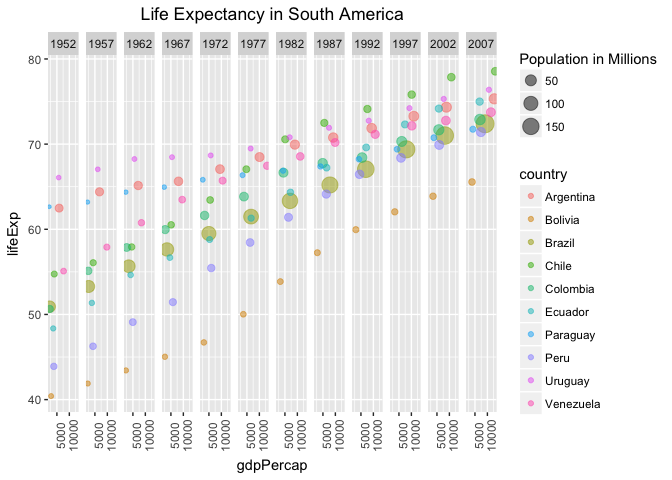
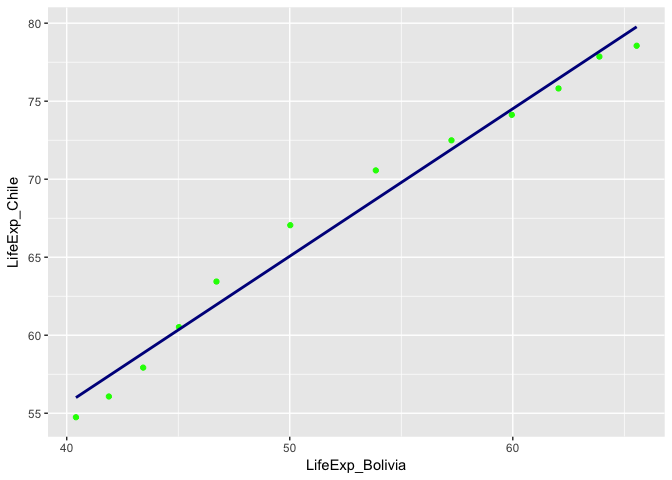
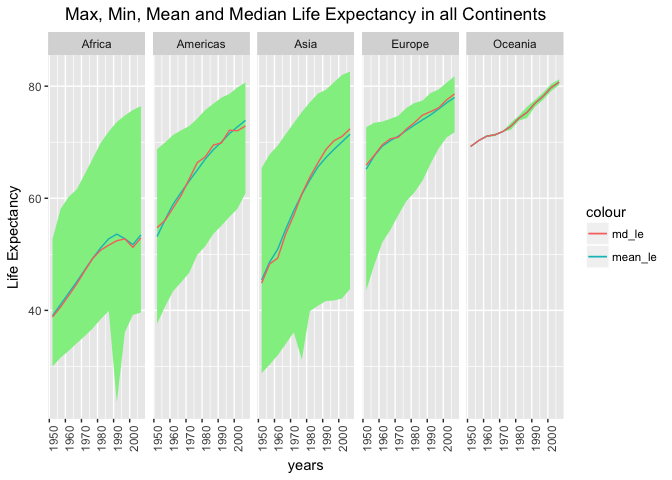

HMW4
================
juan
2017-10-04

``` r
library(gapminder)
suppressMessages(library(tidyverse))
```

Activity: Make a tibble with one row per year and columns for life expectancy for two or more countries. Use knitr::kable() to make this table look pretty in your rendered homework. Take advantage of this new data shape to scatterplot life expectancy for one country against that of another.

I'd like to work with countries in South America. Before picking my two countries I'd like to see all their life expectancies, gdps and populations to pick two with high contrast.
-----------------------------------------------------------------------------------------------------------------------------------------------------------------------------------

``` r
south_america<-  c("Colombia", "Chile", "Argentina", "Uruguay", "Ecuador", "Bolivia", "Paraguay", "Peru", "Brazil", "Venezuela")
south<-gapminder %>%
  filter(country %in% south_america) %>%
  arrange(country)
south %>% head(15) %>% 
   knitr::kable(format = "markdown", padding=2, caption= "Preview of the Growth of Life expectancy in South America")
```

| country   | continent |  year|  lifeExp|       pop|  gdpPercap|
|:----------|:----------|-----:|--------:|---------:|----------:|
| Argentina | Americas  |  1952|   62.485|  17876956|   5911.315|
| Argentina | Americas  |  1957|   64.399|  19610538|   6856.856|
| Argentina | Americas  |  1962|   65.142|  21283783|   7133.166|
| Argentina | Americas  |  1967|   65.634|  22934225|   8052.953|
| Argentina | Americas  |  1972|   67.065|  24779799|   9443.039|
| Argentina | Americas  |  1977|   68.481|  26983828|  10079.027|
| Argentina | Americas  |  1982|   69.942|  29341374|   8997.897|
| Argentina | Americas  |  1987|   70.774|  31620918|   9139.671|
| Argentina | Americas  |  1992|   71.868|  33958947|   9308.419|
| Argentina | Americas  |  1997|   73.275|  36203463|  10967.282|
| Argentina | Americas  |  2002|   74.340|  38331121|   8797.641|
| Argentina | Americas  |  2007|   75.320|  40301927|  12779.380|
| Bolivia   | Americas  |  1952|   40.414|   2883315|   2677.326|
| Bolivia   | Americas  |  1957|   41.890|   3211738|   2127.686|
| Bolivia   | Americas  |  1962|   43.428|   3593918|   2180.973|

``` r
south %>% 
  ggplot(aes(gdpPercap , lifeExp, size= pop/10^6, colour= country )) +
    facet_grid(~ year) +
    geom_point(alpha= 0.5)+
    theme(axis.text.x = element_text(angle=90),
          plot.title = element_text(hjust=0.5))+
    ggtitle("Life Expectancy in South America")+
    scale_size_continuous("Population in Millions") 
```



The results show that Bolivia has always had the lowest life expectancy in the region. On the other hand, Chile became the country with the highest life expectancy in 1987.
----------------------------------------------------------------------------------------------------------------------------------------------------------------------------

``` r
twocountries <- gapminder %>%
  select(country, year, lifeExp) %>%
  filter(country=="Bolivia"| country== "Chile") %>% 
  spread(key = country, value = lifeExp) %>% 
  setNames(c("Year", "LifeExp_Bolivia", "LifeExp_Chile" ))
twocountries %>% 
    knitr::kable()
```

|  Year|  LifeExp\_Bolivia|  LifeExp\_Chile|
|-----:|-----------------:|---------------:|
|  1952|            40.414|          54.745|
|  1957|            41.890|          56.074|
|  1962|            43.428|          57.924|
|  1967|            45.032|          60.523|
|  1972|            46.714|          63.441|
|  1977|            50.023|          67.052|
|  1982|            53.859|          70.565|
|  1987|            57.251|          72.492|
|  1992|            59.957|          74.126|
|  1997|            62.050|          75.816|
|  2002|            63.883|          77.860|
|  2007|            65.554|          78.553|

### Let's see the results compared in the graph

``` r
twocountries %>% 
  ggplot(aes(LifeExp_Bolivia,LifeExp_Chile))+
  geom_point( colour= "green")+
  geom_smooth(method = "lm", se = FALSE, colour= "darkblue")
```



Activity:

Compute some measure of life expectancy (mean? median? min? max?) for all possible combinations of continent and year. Reshape that to have one row per year and one variable for each continent. Or the other way around: one row per continent and one variable per year.Use knitr::kable() to make these tables look pretty in your rendered homework.Is there a plot that is easier to make with the data in this shape versis the usual form? If so (or you think so), try it! Reflect.

``` r
lifeEx_world<- gapminder %>%
  group_by(year, continent) %>% 
  select(lifeExp, continent) %>% 
summarise(mean_le= mean(lifeExp, trim= 0.2), max_le= max(lifeExp), min_le= min(lifeExp), md_le= median(lifeExp)) 
```

    ## Adding missing grouping variables: `year`

``` r
maxlifeEx_world<-lifeEx_world %>% 
  select(year, max_le, continent) %>% 
    spread(key = year, value = max_le) %>% 
  knitr::kable(format = "markdown", padding=2, caption= "Max Life Expectancy per year in all Countries")
maxlifeEx_world
```

<table style="width:100%;">
<colgroup>
<col width="10%" />
<col width="7%" />
<col width="7%" />
<col width="7%" />
<col width="7%" />
<col width="7%" />
<col width="7%" />
<col width="7%" />
<col width="7%" />
<col width="7%" />
<col width="7%" />
<col width="7%" />
<col width="7%" />
</colgroup>
<thead>
<tr class="header">
<th align="left">continent</th>
<th align="right">1952</th>
<th align="right">1957</th>
<th align="right">1962</th>
<th align="right">1967</th>
<th align="right">1972</th>
<th align="right">1977</th>
<th align="right">1982</th>
<th align="right">1987</th>
<th align="right">1992</th>
<th align="right">1997</th>
<th align="right">2002</th>
<th align="right">2007</th>
</tr>
</thead>
<tbody>
<tr class="odd">
<td align="left">Africa</td>
<td align="right">52.724</td>
<td align="right">58.089</td>
<td align="right">60.246</td>
<td align="right">61.557</td>
<td align="right">64.274</td>
<td align="right">67.064</td>
<td align="right">69.885</td>
<td align="right">71.913</td>
<td align="right">73.615</td>
<td align="right">74.772</td>
<td align="right">75.744</td>
<td align="right">76.442</td>
</tr>
<tr class="even">
<td align="left">Americas</td>
<td align="right">68.750</td>
<td align="right">69.960</td>
<td align="right">71.300</td>
<td align="right">72.130</td>
<td align="right">72.880</td>
<td align="right">74.210</td>
<td align="right">75.760</td>
<td align="right">76.860</td>
<td align="right">77.950</td>
<td align="right">78.610</td>
<td align="right">79.770</td>
<td align="right">80.653</td>
</tr>
<tr class="odd">
<td align="left">Asia</td>
<td align="right">65.390</td>
<td align="right">67.840</td>
<td align="right">69.390</td>
<td align="right">71.430</td>
<td align="right">73.420</td>
<td align="right">75.380</td>
<td align="right">77.110</td>
<td align="right">78.670</td>
<td align="right">79.360</td>
<td align="right">80.690</td>
<td align="right">82.000</td>
<td align="right">82.603</td>
</tr>
<tr class="even">
<td align="left">Europe</td>
<td align="right">72.670</td>
<td align="right">73.470</td>
<td align="right">73.680</td>
<td align="right">74.160</td>
<td align="right">74.720</td>
<td align="right">76.110</td>
<td align="right">76.990</td>
<td align="right">77.410</td>
<td align="right">78.770</td>
<td align="right">79.390</td>
<td align="right">80.620</td>
<td align="right">81.757</td>
</tr>
<tr class="odd">
<td align="left">Oceania</td>
<td align="right">69.390</td>
<td align="right">70.330</td>
<td align="right">71.240</td>
<td align="right">71.520</td>
<td align="right">71.930</td>
<td align="right">73.490</td>
<td align="right">74.740</td>
<td align="right">76.320</td>
<td align="right">77.560</td>
<td align="right">78.830</td>
<td align="right">80.370</td>
<td align="right">81.235</td>
</tr>
</tbody>
</table>

``` r
minlifeEx_world<-lifeEx_world %>% 
  select(year, min_le, continent) %>% 
    spread(key = year, value = min_le) %>% 
  knitr::kable(format = "markdown", padding=2, caption= "Min Life Expectancy per year in all Countries")
minlifeEx_world
```

<table style="width:100%;">
<colgroup>
<col width="10%" />
<col width="7%" />
<col width="7%" />
<col width="7%" />
<col width="7%" />
<col width="7%" />
<col width="7%" />
<col width="7%" />
<col width="7%" />
<col width="7%" />
<col width="7%" />
<col width="7%" />
<col width="7%" />
</colgroup>
<thead>
<tr class="header">
<th align="left">continent</th>
<th align="right">1952</th>
<th align="right">1957</th>
<th align="right">1962</th>
<th align="right">1967</th>
<th align="right">1972</th>
<th align="right">1977</th>
<th align="right">1982</th>
<th align="right">1987</th>
<th align="right">1992</th>
<th align="right">1997</th>
<th align="right">2002</th>
<th align="right">2007</th>
</tr>
</thead>
<tbody>
<tr class="odd">
<td align="left">Africa</td>
<td align="right">30.000</td>
<td align="right">31.570</td>
<td align="right">32.767</td>
<td align="right">34.113</td>
<td align="right">35.400</td>
<td align="right">36.788</td>
<td align="right">38.445</td>
<td align="right">39.906</td>
<td align="right">23.599</td>
<td align="right">36.087</td>
<td align="right">39.193</td>
<td align="right">39.613</td>
</tr>
<tr class="even">
<td align="left">Americas</td>
<td align="right">37.579</td>
<td align="right">40.696</td>
<td align="right">43.428</td>
<td align="right">45.032</td>
<td align="right">46.714</td>
<td align="right">49.923</td>
<td align="right">51.461</td>
<td align="right">53.636</td>
<td align="right">55.089</td>
<td align="right">56.671</td>
<td align="right">58.137</td>
<td align="right">60.916</td>
</tr>
<tr class="odd">
<td align="left">Asia</td>
<td align="right">28.801</td>
<td align="right">30.332</td>
<td align="right">31.997</td>
<td align="right">34.020</td>
<td align="right">36.088</td>
<td align="right">31.220</td>
<td align="right">39.854</td>
<td align="right">40.822</td>
<td align="right">41.674</td>
<td align="right">41.763</td>
<td align="right">42.129</td>
<td align="right">43.828</td>
</tr>
<tr class="even">
<td align="left">Europe</td>
<td align="right">43.585</td>
<td align="right">48.079</td>
<td align="right">52.098</td>
<td align="right">54.336</td>
<td align="right">57.005</td>
<td align="right">59.507</td>
<td align="right">61.036</td>
<td align="right">63.108</td>
<td align="right">66.146</td>
<td align="right">68.835</td>
<td align="right">70.845</td>
<td align="right">71.777</td>
</tr>
<tr class="odd">
<td align="left">Oceania</td>
<td align="right">69.120</td>
<td align="right">70.260</td>
<td align="right">70.930</td>
<td align="right">71.100</td>
<td align="right">71.890</td>
<td align="right">72.220</td>
<td align="right">73.840</td>
<td align="right">74.320</td>
<td align="right">76.330</td>
<td align="right">77.550</td>
<td align="right">79.110</td>
<td align="right">80.204</td>
</tr>
</tbody>
</table>

``` r
lifeEx_world %>% 
  ggplot(aes(x= year, y= mean_le )) +
  facet_grid(~ continent)+
    geom_ribbon(aes(ymin= min_le, ymax= max_le), fill= "lightgreen")+
  geom_line(aes(y= mean_le, colour= "mean_le"))+
      theme(axis.text.x = element_text(angle=90),
          plot.title = element_text(hjust=0.5))+
    geom_line(aes(y=md_le , colour= "md_le"))+
      ggtitle("Max, Min, Mean and Median Life Expectancy in all Continents")+
      ylab("Life Expectancy")+
      xlab("years") 
```



Join, merge, look up: Problem: You have two data sources and you need info from both in one new data object. Solution: Perform a join, which borrows terminology from the database world, specifically SQL.

Activity: Create a second data frame, complementary to Gapminder. Join this with (part of) Gapminder using a dplyr join function and make some observations about the process and result. Explore the different types of joins.

``` r
south_america<-  c("Colombia", "Chile", "Argentina", "Uruguay", "Ecuador", "Bolivia", "Paraguay", "Peru", "Brazil", "Venezuela")
dataset1<- gapminder %>%
  filter(country %in% south_america, year== 2007) %>%
  select(country, pop, gdpPercap, year)


  country= c("Guyana", "Colombia", "Suriname", "Chile", "Argentina", "Uruguay", "Ecuador", "Bolivia", "Paraguay", "Peru", "Brazil", "Venezuela", "French Guiana")
  official_languages= c("English", "Spanish" ,"Dutch", "Spanish", "Spanish", "Spanish", "Spanish", "Spanish", "Spanish", "Spanish", "Portuguese", "Spanish", "French") 
  capital_city= c("Georgetown", "Bogota", "Paramaribo", "Santiago", "Buenos Aires", "Montevideo", "Quito", "La Paz", "Asuncion", "Lima", "Brazilia", "Caracas", "Cayenne")
dataset2<- data.frame(country, capital_city, official_languages)

dataset3<- data.frame(capital_city, indigenous_languages= c("Caribean", "Quechua","Caribean" , "Aymara", "Quechua", "Guarani" ,"Quechua", "Aymara" , "Guarani","Aymara","Tupian" ,"Quechua", "Caribean"), official_languages )

dataset1 %>% 
  knitr::kable(format = "markdown", padding=2, caption= "South America General Info")
```

| country   |        pop|  gdpPercap|  year|
|:----------|----------:|----------:|-----:|
| Argentina |   40301927|  12779.380|  2007|
| Bolivia   |    9119152|   3822.137|  2007|
| Brazil    |  190010647|   9065.801|  2007|
| Chile     |   16284741|  13171.639|  2007|
| Colombia  |   44227550|   7006.580|  2007|
| Ecuador   |   13755680|   6873.262|  2007|
| Paraguay  |    6667147|   4172.838|  2007|
| Peru      |   28674757|   7408.906|  2007|
| Uruguay   |    3447496|  10611.463|  2007|
| Venezuela |   26084662|  11415.806|  2007|

``` r
dataset2 %>% 
  knitr::kable(format = "markdown", padding=2, caption= " Languages in South America")
```

| country       | capital\_city | official\_languages |
|:--------------|:--------------|:--------------------|
| Guyana        | Georgetown    | English             |
| Colombia      | Bogota        | Spanish             |
| Suriname      | Paramaribo    | Dutch               |
| Chile         | Santiago      | Spanish             |
| Argentina     | Buenos Aires  | Spanish             |
| Uruguay       | Montevideo    | Spanish             |
| Ecuador       | Quito         | Spanish             |
| Bolivia       | La Paz        | Spanish             |
| Paraguay      | Asuncion      | Spanish             |
| Peru          | Lima          | Spanish             |
| Brazil        | Brazilia      | Portuguese          |
| Venezuela     | Caracas       | Spanish             |
| French Guiana | Cayenne       | French              |

``` r
dataset3 %>% 
  knitr::kable(format = "markdown", padding=2, caption= " Capitals in South America")
```

| capital\_city | indigenous\_languages | official\_languages |
|:--------------|:----------------------|:--------------------|
| Georgetown    | Caribean              | English             |
| Bogota        | Quechua               | Spanish             |
| Paramaribo    | Caribean              | Dutch               |
| Santiago      | Aymara                | Spanish             |
| Buenos Aires  | Quechua               | Spanish             |
| Montevideo    | Guarani               | Spanish             |
| Quito         | Quechua               | Spanish             |
| La Paz        | Aymara                | Spanish             |
| Asuncion      | Guarani               | Spanish             |
| Lima          | Aymara                | Spanish             |
| Brazilia      | Tupian                | Portuguese          |
| Caracas       | Quechua               | Spanish             |
| Cayenne       | Caribean              | French              |

The goal will be to get a table with the country, capital city, population, official language and indigenous language. As we could see previously, parts of that information is stored in 3 different datasets and I need to join them and keep what I need from each of them.
------------------------------------------------------------------------------------------------------------------------------------------------------------------------------------------------------------------------------------------------------------------------------

### things to notice:

-   dataset 1 has 10 countries while dataset 2 and 3 have 13, so some joins will bring null values.
-   datasets are joined either by country or official language

1.  left\_join: It brings the values from dataset2 into dataset 1. 3 Values are lost: Guyana, Suriname and French Guiana.

``` r
left_join(dataset1, dataset2, by= "country")%>% 
  knitr::kable()
```

    ## Warning: Column `country` joining factors with different levels, coercing
    ## to character vector

| country   |        pop|  gdpPercap|  year| capital\_city | official\_languages |
|:----------|----------:|----------:|-----:|:--------------|:--------------------|
| Argentina |   40301927|  12779.380|  2007| Buenos Aires  | Spanish             |
| Bolivia   |    9119152|   3822.137|  2007| La Paz        | Spanish             |
| Brazil    |  190010647|   9065.801|  2007| Brazilia      | Portuguese          |
| Chile     |   16284741|  13171.639|  2007| Santiago      | Spanish             |
| Colombia  |   44227550|   7006.580|  2007| Bogota        | Spanish             |
| Ecuador   |   13755680|   6873.262|  2007| Quito         | Spanish             |
| Paraguay  |    6667147|   4172.838|  2007| Asuncion      | Spanish             |
| Peru      |   28674757|   7408.906|  2007| Lima          | Spanish             |
| Uruguay   |    3447496|  10611.463|  2007| Montevideo    | Spanish             |
| Venezuela |   26084662|  11415.806|  2007| Caracas       | Spanish             |

1.  right\_join: keeps the values in dataset2 and brings the values in dataset1. Guyana, Suriname and French Guiana appear with null values.

``` r
country_pop<- right_join(dataset1, dataset2, by= "country") %>% select(country, pop)
```

    ## Warning: Column `country` joining factors with different levels, coercing
    ## to character vector

``` r
country_pop %>% 
  knitr::kable()
```

| country       |        pop|
|:--------------|----------:|
| Guyana        |         NA|
| Colombia      |   44227550|
| Suriname      |         NA|
| Chile         |   16284741|
| Argentina     |   40301927|
| Uruguay       |    3447496|
| Ecuador       |   13755680|
| Bolivia       |    9119152|
| Paraguay      |    6667147|
| Peru          |   28674757|
| Brazil        |  190010647|
| Venezuela     |   26084662|
| French Guiana |         NA|

1.  inner\_join: joins the common values in the two datasets.

``` r
country_langs<-inner_join(dataset2, dataset3, by= c("capital_city", "official_languages")) 
country_langs %>% 
  knitr::kable()
```

| country       | capital\_city | official\_languages | indigenous\_languages |
|:--------------|:--------------|:--------------------|:----------------------|
| Guyana        | Georgetown    | English             | Caribean              |
| Colombia      | Bogota        | Spanish             | Quechua               |
| Suriname      | Paramaribo    | Dutch               | Caribean              |
| Chile         | Santiago      | Spanish             | Aymara                |
| Argentina     | Buenos Aires  | Spanish             | Quechua               |
| Uruguay       | Montevideo    | Spanish             | Guarani               |
| Ecuador       | Quito         | Spanish             | Quechua               |
| Bolivia       | La Paz        | Spanish             | Aymara                |
| Paraguay      | Asuncion      | Spanish             | Guarani               |
| Peru          | Lima          | Spanish             | Aymara                |
| Brazil        | Brazilia      | Portuguese          | Tupian                |
| Venezuela     | Caracas       | Spanish             | Quechua               |
| French Guiana | Cayenne       | French              | Caribean              |

1.  Now, we have all we need in country\_pop and country\_langs. I will bring them together with a final join and there we get all the information we needed in one dataset.

``` r
right_join(country_pop, country_langs, by= "country")%>% 
  knitr::kable()
```

    ## Warning: Column `country` joining character vector and factor, coercing
    ## into character vector

| country       |        pop| capital\_city | official\_languages | indigenous\_languages |
|:--------------|----------:|:--------------|:--------------------|:----------------------|
| Guyana        |         NA| Georgetown    | English             | Caribean              |
| Colombia      |   44227550| Bogota        | Spanish             | Quechua               |
| Suriname      |         NA| Paramaribo    | Dutch               | Caribean              |
| Chile         |   16284741| Santiago      | Spanish             | Aymara                |
| Argentina     |   40301927| Buenos Aires  | Spanish             | Quechua               |
| Uruguay       |    3447496| Montevideo    | Spanish             | Guarani               |
| Ecuador       |   13755680| Quito         | Spanish             | Quechua               |
| Bolivia       |    9119152| La Paz        | Spanish             | Aymara                |
| Paraguay      |    6667147| Asuncion      | Spanish             | Guarani               |
| Peru          |   28674757| Lima          | Spanish             | Aymara                |
| Brazil        |  190010647| Brazilia      | Portuguese          | Tupian                |
| Venezuela     |   26084662| Caracas       | Spanish             | Quechua               |
| French Guiana |         NA| Cayenne       | French              | Caribean              |

Reflexion
---------

I had a bit of trouble reshaping data. I did not use gather() for that reason. I need to practice more with those two functions as well as with the other types of joins. I realized that if you join two tables using a column that does not have unique values (like official\_languages) the results are very messy.
